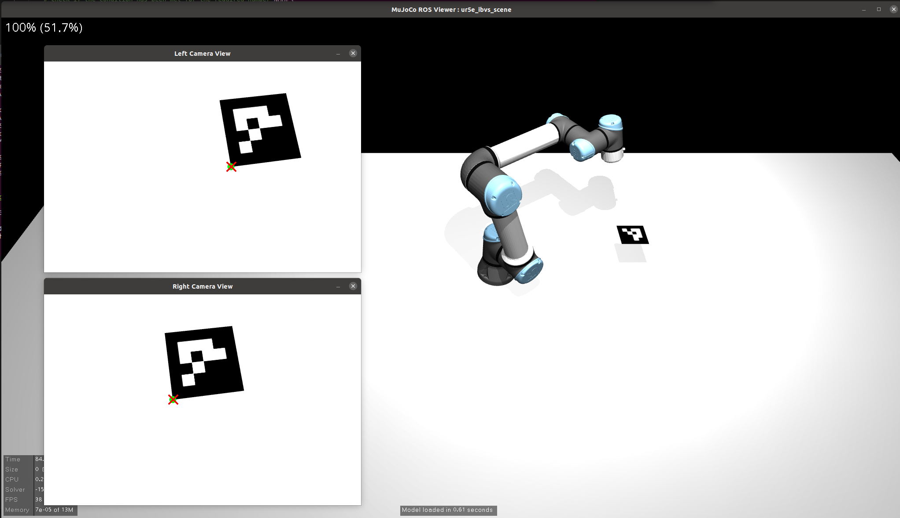

# Stereo Image-Based Visual Servoing


This repository contains a ROS-based simulation environment for controlling a UR5e robotic arm using Stereo Image-Based Visual Servoing (IBVS). The project demonstrates how to precisely guide a simulated tool—represented by a Virtual Tool Center Point (TCP)—onto a single target feature point.

The core of this project is the transition from a monocular to a stereo vision setup to overcome the rank-deficiency of the image Jacobian when tracking a single point feature. This allows for full 3D translational control of the robot's end-effector. The system is built within the MuJoCo physics simulator and integrated with the ROS Noetic ecosystem.


---

## Prerequisites

- ROS Noetic
- `mujoco_ros` and `mujoco_ros_control` packages
- MoveIt! configured for the UR5e
- Python 3 with libraries: `numpy`, `scipy`, `opencv-python`, `cv_bridge`


---

## Usage


### 1. Launch the Simulation Environment

This command starts the MuJoCo simulator, loads the robot and environment models, launches the ROS controllers, and brings up the MoveIt! planning context.

```bash
roslaunch ibvs_ur5_sim ibvs_simulation.launch
```

After launching, you should see the MuJoCo window displaying the UR5e robot in the simulation scene.

### 2. Start the Vision Perception Node

This node is responsible for all vision-related tasks. It subscribes to the stereo camera image topics, detects the ArUco marker's corner, and calculates the static target pixel coordinates by projecting the virtual TCP.

```bash
rosrun ibvs_ur5_sim aruco_detector_node.py
```

### 3. Start the Visual Servoing Control Node

This is the core control node. It subscribes to the feature data from the perception node and implements the stereo IBVS control law. It calculates the required end-effector velocity, converts it into a target pose, and sends motion commands to the robot via MoveIt! to align the virtual TCP with the target feature.

```bash
rosrun ibvs_ur5_sim ibvs_control_node.py
```

---

